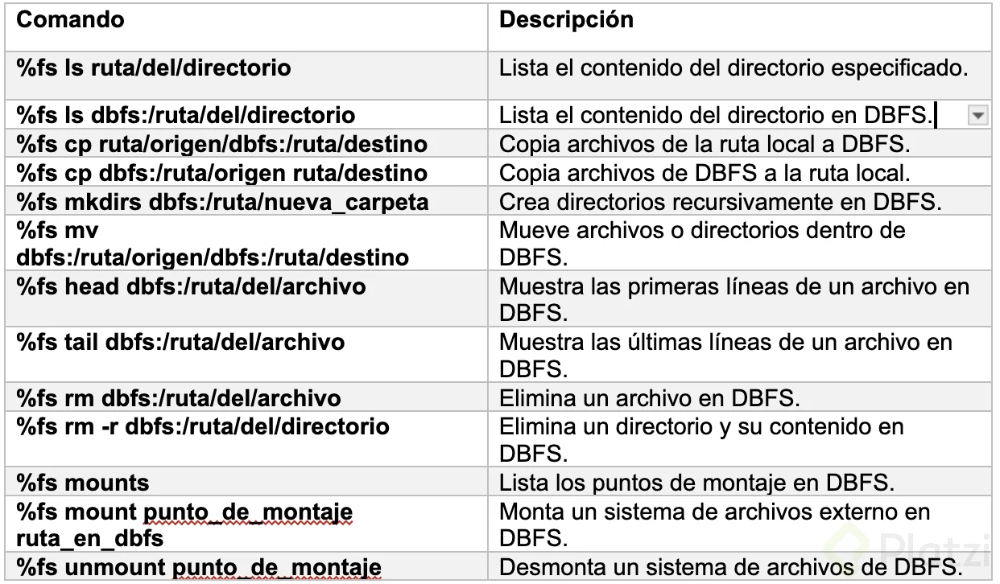

# Arquitecturas Data Lake y Delta Lake

## Arquitectura Data Lake

Arquitectura de 3 capas fundamentales:

1. Landing: Zonda de aterrizaje de archivos - Textos planos
2. Universal: Zona de limpieza, modelamiento y binarización. - Parquets u archivos columnares
3. Solution: Zona de solucione de negocio. - Parquets u archivos columnares

## Arquitectura Delta Lake

1. Bronze Lo mismo que landing
2. Silver: Zona de limpieza - Delta
3. Gold: Zona de soluciones de negocio - Delta

## Parquets vs Delta

* Formatos binarios
* Parquet: Formato binario standar, ya que un montón de tecnologías lo usan.
* Delta: Parquet mejorado. El formato delta permite operaciones ACID.

## Características del Delta Lake

* Transacciones ACID: Proporciona soporte nativo para transacciones ACID, lo que garantiza un rendimiento fluido de lectua y escritura, y consistente incluso en entornos distribuidos.
* Control de versiónes: Admite un historial de versiones completo de los datos almacenados, lo que le permite analizar los camibos a lo largo del tiempo y volver a versaiones anteriores si es necesario.
* Operaciones de fusi´no y actualización: Facilita las operaciones e fisión y actualización de datos, lo que simplifica el procesamiento y la edición de datos
* Optimización de lectgura y escritura: Contiene optimizaciones que aceleran las operaciones de lectura y escritura, como la indexación y al gestión d eestadísticas que mejoran el rendimiento en comparación con el uso del sistema de archivos directamente sin estas optimizaciónes,.
* Compatibilidad con apacha spark: Delta lake es totalmente compatible con apache spark lo qeu facitlita la integración en el ecosistema spark y rpeovecha las capaciodades de procesamiento distribuido.
* Evolución del esquema; Faxcilita la evolucióndel esquema de datos a lo largo del tiempo, permitiendo cambios en la estructura de datos sin afectar la compatibilidad con versiones anteriores.
* Gestión de metadatos: Delta lake almacena metadatos inernos que proporcionan información osbre los datos, facilitando la gtestión y el control de los datos.

## Beneficios del delta lake

* Integridad y coherencia de los datos: La gestión de transacciones ACID garantiza la integridad y la cohjerancia de los datos, lo cual es fundamental en entornos donde la precisión de los datos es fundamental.
* Mejor rendimietno: Las optimizacionesj internas, como la indexaci´no y la gestión de estadíasicas, mejoran el rendimiento de las operaciones de lectura yt escritura y permiten un acceso más eficiente a los datos.
* Historial de versiones para revisión: El historial de verisones le permite monitorear y analizar los camibos de datos a lo largo del tiempo y proporicona uuna descripción detallada de la evolución de los conjuntos de datos.
* Flexibilidad en el desarrollo del esquema: La capacidad de evolucionar sin problemas el esquema de datos facilita una adptación perfecta a los camibos comerciales.
* Operaciones simplificadas: Delta lake simplifica operaciones como la fusión y la actualización lo que facilita el trabajo con datos.
* Compatibilidad con herramientas de Big Data: Al admitir apache spark, delta lake se puede utilizar fácilmente con otras herraimentas de BigData, ampliando su aplicabilidad en entornos distribuidos.

## COnclusión de Delta Lake

Permite dar soluciones de Gestión y almacenamiento de datos comunes a proyectos de Business intelligence.

# Medallion architectura

## Lakehouse

Es un Data Lake con el beneficio de la utilización de metadatos para tener una lógica que permita manejar estrucutras de datos estructuradas-.

## Creación de canales de datos confiables yu de alto rendimiento con Delta Lake

### Bronze

Datos crudos subidos de una.

### Silver

filtro, limpieza y transformaciones de datos

### Golden

Aptos para uso del usuario.

Desagregados de manera que esten altamente disponibles para el uso de visualizaciones u modelos de machine learning.

## Comandos esenciuales para Databricks File System

