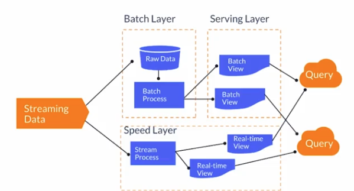
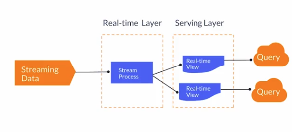
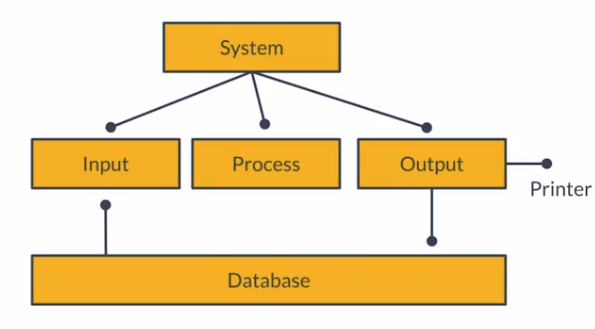

# Arquitectura Lambda

## Origen

Escalable, tolerante a fallos y de procesamiento de datos

## Robustez

Busca satisfacer las necesidades de un sitema robusto capaz de soportar múltiples cargas de trabajo

## Composición

Compuesto de 3 capas: Batch, Serve y Speed

* Batch Layer: Procesar información que producimos el día de ayer
* Serving layer: Vistas cargadas con batch
* Speed layer: Streaming

Estas dos etapas alimentan las queries de información yu otros servicios

# Arquitectura Kappa

Pilares:

1. Todo es stream
2. Información origen no modificada: todo se va a manejar como string
3. SOlo un flujo de procesamiento
4. Capaz de reprocesar

En el serving layer estan servicios de visualización, reporte, etc.

### Ejemplos

* Programas de marketing
* Operaciones de mercado

# Arquitectura Batch

