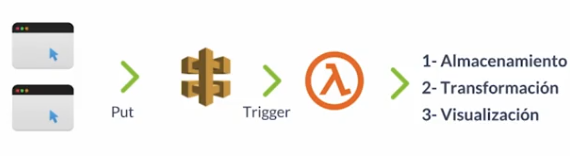
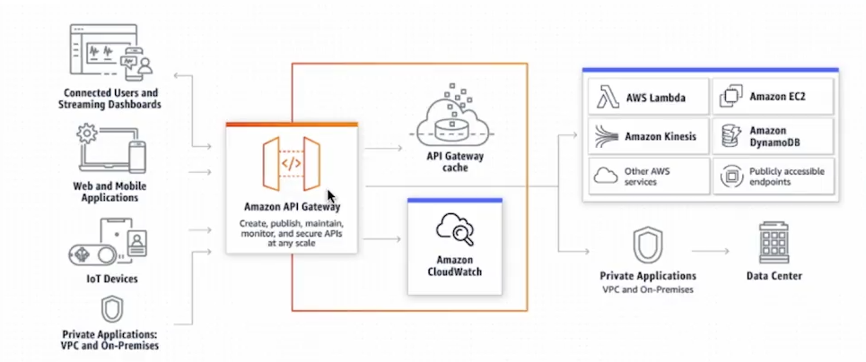
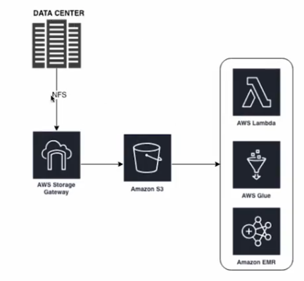
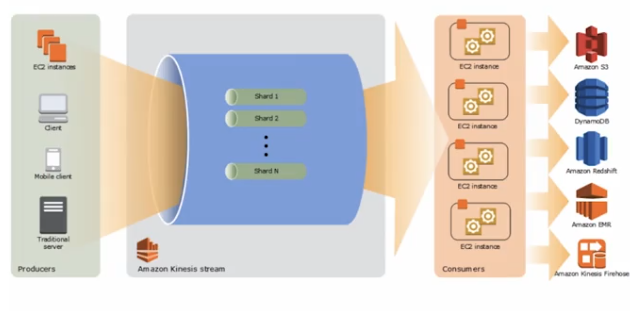

# Extracción de información

Como llevar datos al cloud, por ejemplo:

* APIS
* Web Scraping

## Herramientas

* SDK: Python, Java, Scala
* CLI: Utilización de la CLI para conectarse a la nube y enviar los eventos
* Servicios: Existen diferentes servicios para recibir/extraer información de diferentes fuentes.

# Servicios de extracción

## API Gateway para Data

* Creat un "Front door" de  nuestras aplicaciones
* Puede manejar cientos de miles de llamadas recurrentes a la API
* Previene ataques de DDoS y exponer nuestras aplicaciones

### Como funciona API Gateway en Big data

Funciona como producción de informaicón

## Storage gateway

1. Permite enviuar información desde on-premise AWS
2. Se podr´pian enviar los logs de una aplicación que corra on-premise a S3 para ser procesados
3. Funciona en una VM instalada en nuestro datacenter.

## AWS Kinesis Data Streams

Características:

1. Recopilar yu procesar grandes cantidades de stream de datos en tiempo real
2. Logs, sociual media, makert data feeds y web clickstreams
3. Se utiliza tambi´ne para hacer agregación de datos

* Data Record: Es la unidad de dato almacenada en kinesis
* Retention period: El tiempo que la data es accesible depués que se agrega al stream, por defecto es 24hs
* Es el encargado de poner el data record en kinesis
* Consumer: Toma los datos records de kinesis streams procesarlos
* Shard: Es una secuencia d data record dentro de un stream
* Se usa para agrupar la data por shard dentro de un stream.
