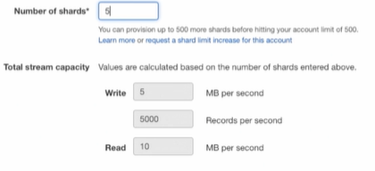

# Extracción de información

Como llevar datos al cloud, por ejemplo:

* APIS
* Web Scraping

## Herramientas

* SDK: Python, Java, Scala
* CLI: Utilización de la CLI para conectarse a la nube y enviar los eventos
* Servicios: Existen diferentes servicios para recibir/extraer información de diferentes fuentes.

# Servicios de extracción

## API Gateway para Data

* Creat un "Front door" de  nuestras aplicaciones
* Puede manejar cientos de miles de llamadas recurrentes a la API
* Previene ataques de DDoS y exponer nuestras aplicaciones

### Como funciona API Gateway en Big data

Funciona como producción de informaicón

## Storage gateway

1. Permite enviuar información desde on-premise AWS
2. Se podr´pian enviar los logs de una aplicación que corra on-premise a S3 para ser procesados
3. Funciona en una VM instalada en nuestro datacenter.

## AWS Kinesis Data Streams

Características:

1. Recopilar yu procesar grandes cantidades de stream de datos en tiempo real
2. Logs, sociual media, makert data feeds y web clickstreams
3. Se utiliza tambi´ne para hacer agregación de datos

* Data Record: Es la unidad de dato almacenada en kinesis
* Retention period: El tiempo que la data es accesible depués que se agrega al stream, por defecto es 24hs
* Es el encargado de poner el data record en kinesis
* Consumer: Toma los datos records de kinesis streams procesarlos
* Shard: Es una secuencia d data record dentro de un stream
* Se usa para agrupar la data por shard dentro de un stream.

### Creación de Kinesis Data Streams

1. Ir a get started
2. Elegimos nuestro kinesis data stream, hay diferentes tipos de streams, en nuestro caso es simplemente Data Stream
3. Ponemos un nombre al stream
4. Determinamos la cantidad de Shards
   1. Este numero depende de la cantidad de trafico que nos va a llegar, en base a esa entrada vamos a calcular los shards
   2. Ejemplo: 
5. Creamos el create data stream
6. Una vez terminamos, podemos ver más detalles:

#### Detalles
* Generic
   * Stream ARN
   * Status
   * Sending data to stream: Puede ser via API o servicios Serverless
   * Server-side encryption: Encriptación de los datos en el stream. (Servicio basado en KMS)
   * Data Retention Period: Tiempo que los datos van a estar disponibles en el stream, por defecto 24hs, pero se puede aumentar hasta 7 días.
   * Shard level metrics; Podemos integrar Kinesis con cloudwatch para monitorear el stream con métricas como:
     * IncomingBytes
     * IncomingRecords
     * WriteProvisionedThroughputExceeded
     * GetRecords.IteratorAgeMilliseconds

* Monitoring
* Tags

### Creación de kinesos con cloudformation
Para ver la creción de un stream con cloudformation, ver el archivo `kinesis.yaml` en la carpeta `cloudformation`.